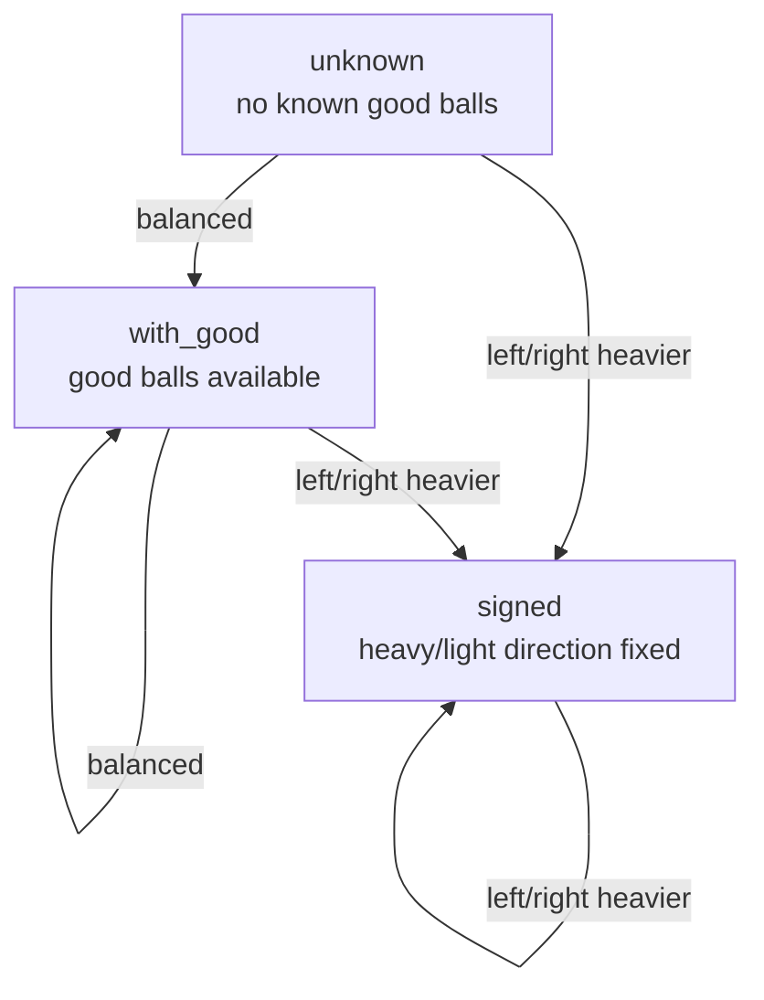

# 13balls
A Python implementation of the classic balance-scale odd-ball puzzle.
## Highlights
- Works for arbitrary `n`, including `13`, `21`, `100`, and beyond
- Supports two modes: `ball-first` and `ball+weight`
- Prints full weighing traces step by step
- Includes tests and saved demo outputs
- Combines puzzle theory, recursion, simulation, and strategy construction

Instead of hard-coding one famous case, this project solves the problem for arbitrary `n`, prints full weighing traces, and verifies strategies by simulation. It includes a fast adaptive solver for large inputs and a fixed balanced-ternary strategy for the heavier/lighter version.

Use a balance scale to find the one odd ball among `n` balls.

This project solves the classic puzzle in two modes:

- `ball-first`:
  use the minimum number of weighings to find which ball is abnormal; weight is reported as `heavier`, `lighter`, or `unknown`
- `ball+weight`:
  use the minimum number of weighings to find both the ball and whether it is heavier or lighter

It works for `n = 13`, `21`, `100`, and larger values.

Chinese README:

- [README_zh.md](/D:/Projects/13balls/README_zh.md)

## Why this project is interesting

- It is not hard-coded for only 12 or 13 balls.
- It supports arbitrary `n`.
- It separates theory, solving, simulation, and testing.
- It can print the full weighing process step by step.

## Files

- [odd_ball.py](/D:/Projects/13balls/odd_ball.py): core solver
- [demo.py](/D:/Projects/13balls/demo.py): pretty command-line demo
- [test_odd_ball.py](/D:/Projects/13balls/test_odd_ball.py): unit tests

## Core ideas

### 1. Two goals, two bounds

If we only want to know **which ball** is odd, `k` weighings can handle at most:

`(3^k - 1) / 2`

If we must know **which ball** and **heavy/light**, `k` weighings can handle at most:

`(3^k - 3) / 2`

That is why:

- `n = 13` needs `3` weighings in `ball-first` mode
- `n = 13` needs `4` weighings in `ball+weight` mode

### 2. Three solver states

The default fast solver switches between three states:

1. `unknown`
   no known normal balls, and the odd ball's direction is still unknown
2. `with_good`
   some balls are already known to be normal
3. `signed`
   each remaining candidate already has a fixed direction: if it is odd, it must be heavy or must be light

This makes the algorithm constructive instead of brute-force.

State transition sketch:



### 3. Two solving styles

`ball-first` mode is adaptive and very fast.

- It builds the next weighing from the current branch.
- It is the default mode.
- It scales well to `n = 100` and beyond.

`ball+weight` mode uses balanced ternary code construction.

- It builds a fixed full strategy.
- It is stronger, but also more expensive.
- It is great for studying the classic coding interpretation of the puzzle.

## Quick start

Run tests:

```powershell
python -m unittest -v
```

Run a demo:

```powershell
python demo.py 13 4 1
```

Meaning:

- `13`: total number of balls
- `4`: ball number 4 is abnormal
- `1`: it is heavier

Use `-1` for lighter:

```powershell
python demo.py 21 17 -1
```

Force the stronger mode that must distinguish heavy vs light:

```powershell
python demo.py 13 4 1 --resolve-weight
```

## Example output

```text
13balls
========
Mode              : ball first, weight if possible
Total balls       : 13
Hidden odd ball   : #4
Hidden weight     : heavier (+1)
Minimum weighings : 3

Weighing Trace
--------------
Round 1  [1, 2, 3, 4]  vs  [5, 6, 7, 8]
         Result : left heavier
         State  : unknown vs unknown

Round 2  [8, 9, 10, 11, 12]  vs  [5, 6, 7, 1, 2]
         Result : balanced
         State  : known-sign candidates

Round 3  [3]  vs  [4]
         Result : right heavier
         State  : known-sign candidates

Verdict
-------
Used weighings : 3
Odd ball       : #4
Weight         : heavier (+1)
Path           : L = R
```

More saved examples:

- [examples/demo_13_heavy.txt](/D:/Projects/13balls/examples/demo_13_heavy.txt)
- [examples/demo_21_light.txt](/D:/Projects/13balls/examples/demo_21_light.txt)
- [examples/demo_13_resolve_weight.txt](/D:/Projects/13balls/examples/demo_13_resolve_weight.txt)

## Python API

Simple use:

```python
from odd_ball import find_special_ball

balls = [0] * 13
balls[3] = 1

count, idx, weight = find_special_ball(balls)
print(count, idx, weight)   # 3, 3, 1
```

Build a strategy object:

```python
from odd_ball import build_strategy

strategy = build_strategy(13)
print(strategy.rounds)      # 3
```

Verify every possibility:

```python
from odd_ball import verify_strategy

print(verify_strategy(13))                     # True
print(verify_strategy(13, build_strategy(13, resolve_weight=True)))  # True
```

## Notes for future GitHub polishing

Nice next steps for showing this project off:

- add benchmark examples such as `n = 100`
- add English and Chinese versions of the README
