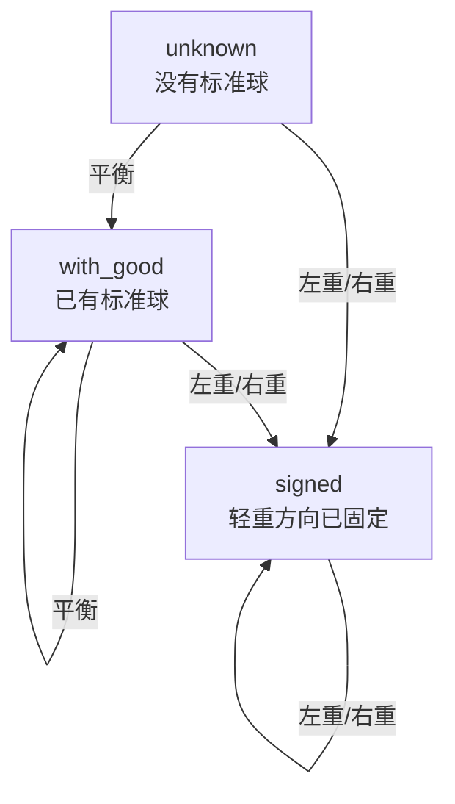

# 13balls

用天平在 `n` 个球里找出唯一的异常球。

这个项目支持两种求解目标：

- `ball-first`
  先用最少次数找出“是哪一个球异常”；轻重能判断就返回 `heavier` 或 `lighter`，不能判断就返回 `unknown`
- `ball+weight`
  用最少次数同时找出“哪一个球异常”以及“它偏重还是偏轻”

它不只支持 `13` 个球，也支持 `21`、`100` 甚至更大的 `n`。

## 这个项目有什么意思

- 不是只写死了某个经典答案
- 可以处理任意 `n`
- 同时包含理论、算法、模拟和测试
- 可以把完整称重过程逐轮打印出来

## 文件说明

- [odd_ball.py](/D:/Projects/13balls/odd_ball.py)：核心求解器
- [demo.py](/D:/Projects/13balls/demo.py)：命令行演示脚本
- [test_odd_ball.py](/D:/Projects/13balls/test_odd_ball.py)：测试
- [README.md](/D:/Projects/13balls/README.md)：英文版说明

## 核心想法

### 1. 两种目标，对应两个上界

如果目标只是确定“哪一个球异常”，那么 `k` 次称重最多处理：

`(3^k - 1) / 2`

如果目标是同时确定“哪一个球异常”和“它是偏重还是偏轻”，那么 `k` 次称重最多处理：

`(3^k - 3) / 2`

所以：

- `n = 13` 在 `ball-first` 模式下只需要 `3` 次
- `n = 13` 在 `ball+weight` 模式下需要 `4` 次

### 2. 默认快算法的三种状态

默认模式会在三种状态之间切换：

1. `unknown`
   还没有标准球，异常球轻重也未知
2. `with_good`
   已经得到一批标准球
3. `signed`
   剩余每个候选球的方向已经固定，如果它异常，就一定是偏重或一定是偏轻

这让算法变成“按规则构造下一次称法”，而不是暴力搜索。

状态切换图：



### 3. 两种求解风格

`ball-first` 模式是默认模式，也是现在最快的模式。

- 它是自适应的
- 每一轮根据当前分支继续构造
- `n = 100` 这种规模也能很快给出答案

`ball+weight` 模式更强，它会构造固定三进制编码策略。

- 能保证区分 heavy / light
- 更适合研究经典天平题的编码思想
- 但构造成本更高

## 快速开始

运行测试：

```powershell
python -m unittest -v
```

运行演示：

```powershell
python demo.py 13 4 1
```

参数含义：

- `13`：总球数
- `4`：第 4 号球异常
- `1`：偏重

如果偏轻，用 `-1`：

```powershell
python demo.py 21 17 -1
```

如果你想强制使用“必须区分轻重”的模式：

```powershell
python demo.py 13 4 1 --resolve-weight
```

## 示例输出

```text
13balls
========
Mode              : ball first, weight if possible
Total balls       : 13
Hidden odd ball   : #4
Hidden weight     : heavier (+1)
Minimum weighings : 3

Weighing Trace
--------------
Round 1  [1, 2, 3, 4]  vs  [5, 6, 7, 8]
         Result : left heavier
         State  : unknown vs unknown

Round 2  [8, 9, 10, 11, 12]  vs  [5, 6, 7, 1, 2]
         Result : balanced
         State  : known-sign candidates

Round 3  [3]  vs  [4]
         Result : right heavier
         State  : known-sign candidates

Verdict
-------
Used weighings : 3
Odd ball       : #4
Weight         : heavier (+1)
Path           : L = R
```

更多现成示例：

- [examples/demo_13_heavy.txt](/D:/Projects/13balls/examples/demo_13_heavy.txt)
- [examples/demo_21_light.txt](/D:/Projects/13balls/examples/demo_21_light.txt)
- [examples/demo_13_resolve_weight.txt](/D:/Projects/13balls/examples/demo_13_resolve_weight.txt)

## Python 用法

最简单的调用方式：

```python
from odd_ball import find_special_ball

balls = [0] * 13
balls[3] = 1

count, idx, weight = find_special_ball(balls)
print(count, idx, weight)   # 3, 3, 1
```

生成策略对象：

```python
from odd_ball import build_strategy

strategy = build_strategy(13)
print(strategy.rounds)      # 3
```

穷举验证全部情况：

```python
from odd_ball import build_strategy, verify_strategy

print(verify_strategy(13))                                   # True
print(verify_strategy(13, build_strategy(13, resolve_weight=True)))  # True
```

## 以后可以继续打磨的方向

- 加一张更漂亮的流程图或状态图
- 加上 `n = 100` 的 benchmark 示例
- 做一个中英双语的项目首页
- 把示例输出做成截图或页面展示

